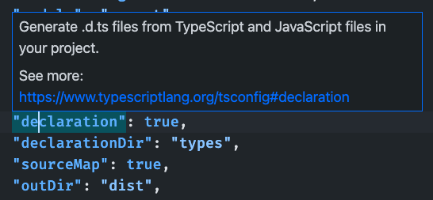
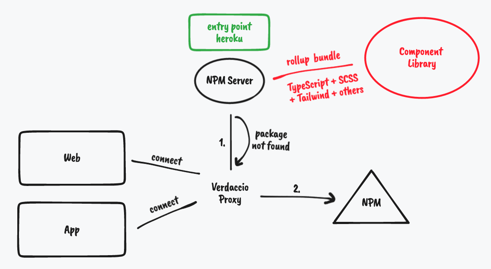

# Build TypeScript + Tailwind + SASS React Component Library

這個專案要教你如何使用 `create-react-app` 和 rollup 還有 verdaccio 建立一個私人的 react component library，我們將在 library 中使用 `TypeScript`, `SASS`, `TailwindCSS` 還有其他的 third-libraries，以及架設好 `Storybook` 以及測試環境。

## About

這個專案基於 [alexeagleson / template-react-component-library](https://github.com/alexeagleson/template-react-component-library)，並且做了以下的調整：

- npm init => `create-react-app`
- Github + npm => Verdaccio + npm
- Add TailwindCSS
- Add third-party libraries

感謝 alexeagleson 的優質文章和教材 😄

## Installation

### Basic Dependencies

``` js
// create new library with CRA and TypeScript
npx create-react-app ts-react-component-library --template typescript

// install SASS
npm i sass

// install other dependencies, for example I want to also use recharts
npm i recharts

// install jest and react-testing-library for testing
npm install @testing-library/react jest @types/jest --save-dev
```

### Install TailwindCSS

我們會用 postcss 方式安裝 TailwindCSS，你只要照著 [create-react-app-guides](https://tailwindcss.com/docs/guides/create-react-app) 中提供的步驟安裝 TailwindCSS 即可。如果你使用 create-react-app 以外的方式安裝 TailwindCSS，你可以到 [framework-guides](https://tailwindcss.com/docs/installation/framework-guides) 尋找安裝方法。

### Install Rollup.js

我們將使用 rollup.js 來打包我們的 component-library。因為 rollup.js 和 webpack 一樣是使用多個 plugins 來分工進行打包工作，所以我們必須要安裝以下的 dependencies：

```
// for basic bundling
npm install rollup @rollup/plugin-node-resolve @rollup/plugin-typescript @rollup/plugin-commonjs rollup-plugin-dts --save-dev

// for postcss & sass
npm install rollup-plugin-postcss --save-dev

// for optimization
npm install rollup-plugin-peer-deps-external rollup-plugin-terser --save-dev
```

## Library Structure

專案的整體架構如下。如果你想使用不同的架構，要記得到進行以下的調整：

- Change the `include` path in `tsconfig.json`
- Change the first `input` in `rollup.config.js`
- **You need to create a css file in the same folder as the entry point in order to import tailwind correctly.**

``` py
.npmrc                  # config npm registry
.package.json           # config dependency, publish
postcss.config.js       # config postcss with tailwind
rollup.config.js        # config run rollup flow
tailwind.config.js      # config tailwind content, styles
tsconfig.json           # config TypeScript compilation

src/
┣  components/
┃ ┣  MyLineChart/
┃ ┃ ┣  MyLineChart.scss
┃ ┃ ┣  MyLineChart.tsx
┃ ┃ ┗  index.ts
┃ ┣  index.scss         # IMPORTANT: import tailwind for library
┃ ┗  index.ts           # IMPORTANT: library entry point
┃
┣  App.tsx              # for develop use
┣  index.scss           # for develop use
┣  index.tsx            # for develop use
┗  setupTests.ts        # for unit test using jest & react-testing-library
```

## Tailwind Config

在 [postcss.config.js](postcss.config.js) 中，除了基本的 Tailwind 設定以外，我還為 tailwind plugin 設定了 config 路徑：

``` js
module.exports = {
    plugins: {
        tailwindcss: { config: "./tailwind.config.js" },
        autoprefixer: {},
    },
};
```

## TypeScript Config

因為我們使用 `create-react-app --template typescript` 來建立專案，所以 `tsconfig.json` 已經被建立好，而且已經有一些預設的設定。

最終的設定檔可以查看 [tsconfig.json](./tsconfig.json)。我們主要增加和改變的地方為：

``` json
"compilerOptions": {
    ...
    "declaration": true,
    "declarationDir": "types",
    "sourceMap": true,
    "outDir": "dist",
    "moduleResolution": "node",
    "allowSyntheticDefaultImports": true,
    "emitDeclarationOnly": true,
},
"include": [
    "src/components"  // should be your entry point
]
```

如果你使用 VSCode 等 IDE 開啟時，將指標放在每個設定上就可以看到用途。



關於更詳細的設定介紹和每個 config 的意義，你可以查看 [alexeagleson/template-react-component-library#adding-typescript](https://github.com/alexeagleson/template-react-component-library#adding-typescript)

## Rollup Config

Rollup 的設定可以分成三大部分，分別為基本設定、CSS 設定、優化設定，最終的設定檔可以查看 [rollup.config.js](rollup.config.js)。我們將把 library 分別打包成一個 Commonjs 和一個 ESM。

在 rollup 中的設定 (config) 可以分成兩大部分：第一部分定義我們的程式碼要如何被編譯、打包成純 JavaScript、如何處理 CSS 檔案、還有優化設定。第二部分主要是定義如何處理生成的 Types 檔案，以及避開 css 的 Type 生成。

### Basic Setup

``` js
{
    input: "src/components/index.ts",  // entry point
    output: [
        {
            file: packageJson.main,    // cjs output point
            format: "cjs",
            sourcemap: true,
        },
        {
            file: packageJson.module,  // esm output point
            format: "esm",
            sourcemap: true,
        },
    ],
    plugins: [
        // 用來打包你有用到的第三方庫
        resolve(),

        // Convert CommonJS modules to ES6
        commonjs(),

        // Teaches rollup how to process Typescript files
        typescript({ tsconfig: "./tsconfig.json" }),
    ],
},
{
    input: "dist/esm/types/index.d.ts",
    output: [{ file: "dist/index.d.ts", format: "esm" }],
    plugins: [dts()],  // rollup your .d.ts files
},
```

更詳細的介紹: [alexeagleson/template-react-component-library#adding-rollup](https://github.com/alexeagleson/template-react-component-library#adding-rollup)

### SCSS Setup

只做 basic 設定不會幫我們打包 CSS/SASS/LESS 等 PreCSS。我們需要引入 `rollup-plugin-postcss` 來幫我們打包這些 css 並寫入 js 當中：

``` js
// NEW
import postcss from "rollup-plugin-postcss";

{
    // first part
    // ...
    plugins: [
            resolve(),
            commonjs(),
            typescript({ tsconfig: "./tsconfig.json" }),
            
            // NEW
            postcss({
                config: {
                    path: "./postcss.config.js",
                },
                minimize: true,
            }),
        ],
}, {
    // second part
    // ...
    plugins: [dts()],
    external: [/\.(css|less|scss)$/], // NEW: avoid generate css types
}
```

更詳細的介紹: [alexeagleson/template-react-component-library#adding-css](https://github.com/alexeagleson/template-react-component-library#adding-css)

### Optimization Setup

我們可以輕鬆的使用 [rollup-plugin-terser](https://www.npmjs.com/package/rollup-plugin-terser) 把打包的 bundle-size 縮得更小。另一個是使用 [rollup-plugin-peer-deps-external](https://www.npmjs.com/package/rollup-plugin-peer-deps-external) 來實現 [peerDependencies](https://nodejs.org/en/blog/npm/peer-dependencies/)，一樣可以使 bundle-size 縮小，並且避免和引入我們 library 的專案發生衝突。

``` js
// NEW
import { terser } from "rollup-plugin-terser";
import peerDepsExternal from 'rollup-plugin-peer-deps-external';

{
    // first part
    // ...
    plugins: [
        // NEW
        peerDepsExternal(),

        resolve(),
        commonjs(),
        typescript(...),
        postcss(...),

        // NEW
        terser(),
    ]
}
```

設定完後記得到 [package.json](package.json) 設定 peerDependencies：

``` js
"peerDependencies": {
    "react": "^18.1.0",
    "react-dom": "^18.1.0"
  }
```

更詳細的介紹: [alexeagleson/template-react-component-library#optimizing](https://github.com/alexeagleson/template-react-component-library#optimizing)


## Package.json

不管你是要 publish 到 npm 還是 verdaccio，你都需要設定一下 [package.json](package.json) 中的幾個參數：

``` json
{
  // required: your npm-title
  "name": "ts-react-component-library",

  // required: need to be incremented before each publish
  "version": "1.0.0",

  // required: need to set false
  "private": false,

  "publishConfig": {
    "registry": "http://localhost:4873"
  },

  "scripts": {
    "test": "react-scripts test",
    "rollup": "rm -rf dist && rollup -c"  // npm run rollup
  },

  // required: output path for commonjs modules
  "main": "dist/cjs/index.js",  

  // required: output path for es6 modules
  "module": "dist/esm/index.js",  

  // required: output directory for our entire library
  "files": [ 
    "dist"  
  ],
  
  // required: location for our library's types
  "types": "dist/index.d.ts",  

  "peerDependencies": {
      ...
  }

  // optional
  "description": "A library for building react components",
  "author": "Jay Wang",
}
```

## Verdaccio NPM Proxy



我們要使用 verdaccio 和 heroku 建立所謂的 **npm proxy** 和本地的 **npm server**，當我們設定好後，執行 `npm install --registry entrypoint` 會讓 npm 先到 heroku 上下載我們私人的 library，然後再到 npm 中下載其他網路上的 library，例如 `react, typescript` 等。

- [Verdaccio Official Website](https://verdaccio.org/)
- [Verdaccio Documentation](https://verdaccio.org/docs/installation)
- [Verdaccio 部署 Heroku 教學](https://medium.com/starbugs/%E7%94%A8-verdaccio-%E5%BF%AB%E9%80%9F%E5%BB%BA%E7%AB%8B%E5%B0%88%E5%B1%AC%E7%9A%84-private-npm-proxy-%E4%B8%A6%E9%83%A8%E7%BD%B2%E5%88%B0-heroku-%E4%B8%8A-7866d2a0494c)

我們可以在專案最上層建立 `.npmrc` 並設定 registry 的網址，這可以讓我們將 `npm install --registry http://localhost:4873` 省略為 `npm install`。

```
// .npmrc
registry=http://localhost:4873
```

其他常用的指令還有：

- `npm get registry` - 可以查看 registry 的設定有沒有正確
- `npm login --registry http://localhost:4873` - 需要在 publish 前登入

## Storybook


## Adding Test

因為我們使用 `create-react-app` 來創建這個專案，所以我們可以很輕鬆的使用內建的 `npm test` 來運行 `react-scripts test` 進行測試。記得專案中必須保留 `src/setupTests.ts` 才能進行元件的測試哦！

如果你想進一步了解如何編寫 unit test，歡迎查看另外一個 repo - [web testing for beginners](https://github.com/windsuzu/web-testing-beginner)。

## TroubleShooting

- NPM warn: You must install peer dependencies yourself.
  - https://stackoverflow.com/questions/46053414/npm-warn-requires-a-peer-of-but-none-is-installed-you-must-install-peer
- Failed to parse source map
  - https://stackoverflow.com/questions/70599784/failed-to-parse-source-map